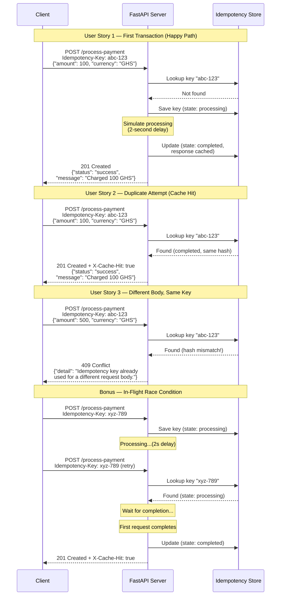

# Idempotency Gateway (The "Pay-Once" Protocol)

This is a robust idempotency layer built with **Python and FastAPI**. It ensures that payment requests are processed exactly once, even if the client retries the request due to network timeouts.

## 1. Architecture Diagram



## 2. Setup Instructions

1. **Prerequisites:** Python 3.8+ installed.
2. **Clone the repository** and navigate to the `backend/Idempotency-gateway` directory.
3. **Create a virtual environment** (optional but recommended):
   ```bash
   python -m venv venv
   source venv/bin/activate  # On Windows: venv\Scripts\activate
   ```
4. **Install dependencies:**
   ```bash
   pip install -r requirements.txt
   ```
5. **Run the server:**
   ```bash
   uvicorn app.main:app --reload
   ```
6. The API will be available at `http://127.0.0.1:8000`. You can view the interactive Swagger documentation at `http://127.0.0.1:8000/docs`.

## 3. API Documentation

### Endpoint: `POST /process-payment`

Processes a payment request securely using idempotency.

**Headers:**
- `Idempotency-Key` (required): A unique string identifying the request.

**Body (JSON):**
```json
{
  "amount": 100,
  "currency": "GHS"
}
```

**Example Curl Command:**
```bash
curl -X POST "http://127.0.0.1:8000/process-payment" \
     -H "Idempotency-Key: unique-key-123" \
     -H "Content-Type: application/json" \
     -d '{"amount": 100, "currency": "GHS"}'
```

**Responses:**
- `201 Created`: Payment processed successfully (or cached successful response).
  - Includes `X-Cache-Hit: true` header if returned from cache.
  - Body: `{"status": "success", "message": "Charged 100 GHS"}`
- `400 Bad Request`: Missing `Idempotency-Key` header.
- `409 Conflict`: The idempotency key was previously used with a different request payload.
  - Body: `{"detail": "Idempotency key already used for a different request body."}`
- `422 Unprocessable Entity`: Invalid JSON payload (e.g., missing amount).

## 4. Design Decisions

- **In-Memory Store:** Used a thread-safe, async-compatible in-memory store (`dict` + `asyncio.Lock` + `asyncio.Event`) for simplicity and performance without external dependencies (like Redis) for this challenge.
- **Concurrency Control:** `asyncio.Lock` per key prevents race conditions when writing. `asyncio.Event` enables in-flight requests to pause and wait for the original request to complete without blocking the main event loop.
- **Payload Hashing:** Used canonical JSON serialization and SHA-256 hashing to securely verify if the request body of a retry matches the original request, preventing fraud/errors.

## 5. Developer's Choice: Key TTL (Time-To-Live) Expiry

**Feature:** Idempotency keys automatically expire after a set duration (default: 24 hours, configurable via `IDEMPOTENCY_TTL_SECONDS` env var). A background task periodically cleans up expired keys from memory.

**Why I added it:**
In a real-world Fintech application (like Stripe), idempotency keys should not be stored indefinitely.
1. **Memory Protection:** Storing every key forever will eventually cause an out-of-memory error.
2. **Business Logic:** An idempotency key is meant to handle temporary network issues. If a client sends the same key a month later, it's likely a bug on their end or a legitimate new transaction that happens to reuse an old key. Having a TTL (e.g., 24h) ensures keys are cleared, balancing safety against memory constraints.
