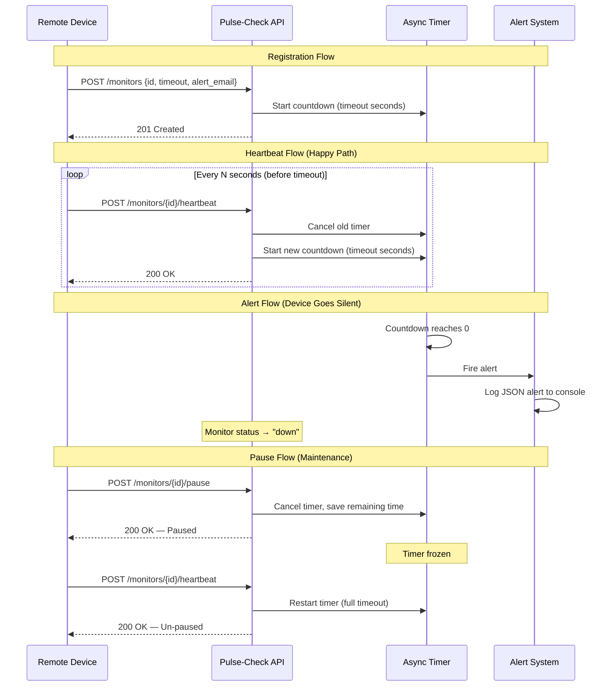
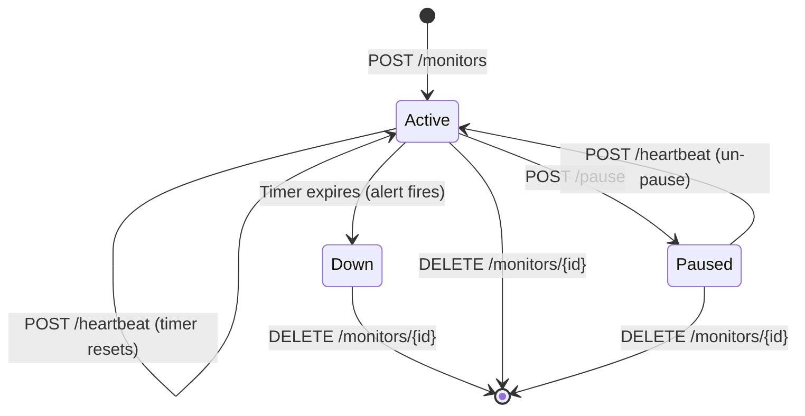

# Pulse-Check API — Dead Man's Switch Service

> A backend monitoring service for **CritMon Servers Inc.** that tracks remote devices via countdown timers and fires alerts when heartbeats stop arriving.

Built with **Python 3.12+** and **FastAPI**.

---

## Architecture Diagram



### State Diagram



---

## Setup Instructions

### Prerequisites

- Python 3.12 or higher
- pip

### Installation

```bash
# 1. Clone the repository
git clone https://github.com/<your-username>/AmaliTech-DEG-Project-based-challenges.git
cd AmaliTech-DEG-Project-based-challenges/backend/Pulse-Check

# 2. Create a virtual environment
python -m venv venv

# 3. Activate the virtual environment
# Windows:
venv\Scripts\activate
# macOS / Linux:
source venv/bin/activate

# 4. Install dependencies
pip install -r requirements.txt
```

### Running the Server

```bash
uvicorn app.main:app --reload
```

The server starts at **http://127.0.0.1:8000**.

Interactive API docs are available at:
- **Swagger UI:** http://127.0.0.1:8000/docs
- **ReDoc:** http://127.0.0.1:8000/redoc

### Running Tests

```bash
pip install pytest httpx
pytest tests/ -v
```

---

## API Documentation

### Base URL

```
http://127.0.0.1:8000
```

---

### 1. Register a Monitor

Create a new device monitor and start its countdown timer.

| | |
|---|---|
| **Endpoint** | `POST /monitors` |
| **Status** | `201 Created` |

**Request Body:**

```json
{
  "id": "device-123",
  "timeout": 60,
  "alert_email": "admin@critmon.com"
}
```

**Response:**

```json
{
  "message": "Monitor for device 'device-123' created with a 60s timeout."
}
```

---

### 2. Send a Heartbeat

Reset the countdown timer for a device. Also un-pauses a paused monitor.

| | |
|---|---|
| **Endpoint** | `POST /monitors/{id}/heartbeat` |
| **Status** | `200 OK` |

**Response:**

```json
{
  "message": "Heartbeat received. Timer for 'device-123' reset to 60s."
}
```

**Error Responses:**

| Status | Condition |
|--------|-----------|
| `404 Not Found` | Monitor ID does not exist |
| `409 Conflict` | Monitor has already expired |

---

### 3. Pause a Monitor

Freeze the countdown timer. No alerts will fire while paused. Send a heartbeat to un-pause.

| | |
|---|---|
| **Endpoint** | `POST /monitors/{id}/pause` |
| **Status** | `200 OK` |

**Response:**

```json
{
  "message": "Monitor 'device-123' is now paused."
}
```

**Error Responses:**

| Status | Condition |
|--------|-----------|
| `404 Not Found` | Monitor ID does not exist |
| `409 Conflict` | Monitor is already paused or has expired |

---

### 4. List All Monitors *(Developer's Choice)*

Get the current status and remaining time for every registered device.

| | |
|---|---|
| **Endpoint** | `GET /monitors` |
| **Status** | `200 OK` |

**Response:**

```json
[
  {
    "id": "device-123",
    "timeout": 60,
    "alert_email": "admin@critmon.com",
    "status": "active",
    "created_at": "2025-01-15T10:30:00Z",
    "last_heartbeat": "2025-01-15T10:30:45Z",
    "time_remaining": 42.18
  }
]
```

---

### 5. Get Monitor Details *(Developer's Choice)*

Get detailed status for a single monitor.

| | |
|---|---|
| **Endpoint** | `GET /monitors/{id}` |
| **Status** | `200 OK` |

**Response:** Same schema as a single item from the list endpoint.

---

### 6. Delete a Monitor *(Developer's Choice)*

Remove a monitor and cancel its timer.

| | |
|---|---|
| **Endpoint** | `DELETE /monitors/{id}` |
| **Status** | `200 OK` |

**Response:**

```json
{
  "message": "Monitor 'device-123' has been deleted."
}
```

---

### 7. Health Check

| | |
|---|---|
| **Endpoint** | `GET /health` |
| **Status** | `200 OK` |

**Response:**

```json
{
  "status": "healthy"
}
```

---

## Developer's Choice: Fleet Status Dashboard

### Why?

The original specification lets devices register, heartbeat, and trigger alerts — but gives **operators no way to see the overall health of their device fleet** without checking individual logs.

### What I Added

Three read/management endpoints that turn the API into a live dashboard:

| Endpoint | Purpose |
|----------|---------|
| `GET /monitors` | List **all** monitors with real-time `time_remaining` |
| `GET /monitors/{id}` | Inspect a single device in detail |
| `DELETE /monitors/{id}` | Deregister a device and cancel its timer |

### How It Helps

- **Situational Awareness:** Support engineers can poll `GET /monitors` to see which devices are healthy, paused, or down — without waiting for alerts.
- **Real-time Countdown:** The `time_remaining` field is computed on-the-fly so operators know exactly how long until a device's next expected heartbeat window closes.
- **Cleanup:** Devices that have been decommissioned can be removed with `DELETE` so they don't clutter the dashboard.

---

## Project Structure

```
Pulse-Check/
├── app/
│   ├── __init__.py           # Package marker
│   ├── main.py               # FastAPI application & route definitions
│   ├── models.py             # Pydantic request/response schemas
│   └── monitor_manager.py    # Core timer logic (asyncio tasks)
├── tests/
│   └── test_api.py           # Automated API tests
├── requirements.txt          # Python dependencies
├── .gitignore
└── README.md                 # This file
```

---

## Tech Stack

| Component | Technology |
|-----------|-----------|
| Language | Python 3.12+ |
| Framework | FastAPI |
| Server | Uvicorn (ASGI) |
| Timer Engine | Python `asyncio` tasks |
| Data Store | In-memory (dict) |
| Testing | pytest + HTTPX |
